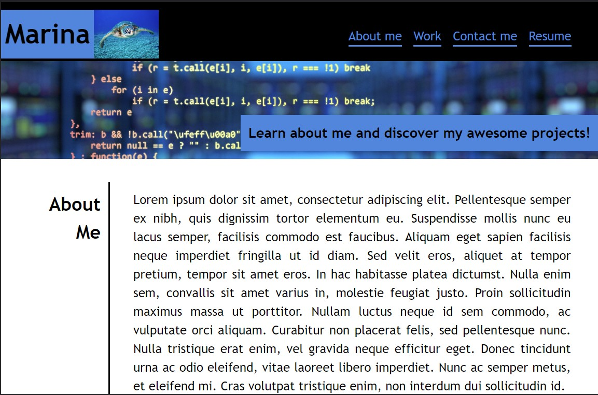

# Portfolio

## Description

This portfolio page was created to display development project to potential employers. It has been built html and CSS, showcasing the use of flexbox, media queries and CSS variables.

NB: currently contains placeholder links

## Installation

N/A

## Usage

https://marinaongithub.github.io/portfolio/

The header section contains the name and photo/avatar of the developer and a navigation bar to scroll directly to each section of the porfolio.
- About me: developer description
- Work: each tile contains a descriptive image and title of the project. When hover the opacity of the image changes and when clicked the title area links to the project. 
- Contact: contains developer contacts and links to socials

## Credits

N/A

## License

N/A